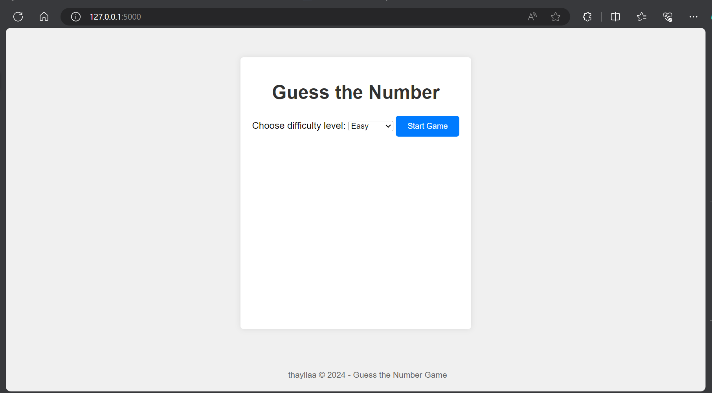

# Guess the Number

Este é um jogo simples de "Adivinhe o Número" desenvolvido em Python com Flask.

## Como Jogar

1. Escolha um nível de dificuldade (Fácil, Médio ou Difícil).
2. Tente adivinhar o número secreto.
3. Você terá um número limitado de tentativas com base no nível de dificuldade escolhido.
4. Se você adivinhar o número secreto, você vence. Caso contrário, continue tentando até acabarem suas tentativas.

## Instalação

1. Clone este repositório.
2. Instale as dependências com `pip install -r requirements.txt`.
3. Execute o jogo com `python index.py`.

## Capturas de Tela

## Tecnologias Usadas

- Python
- Flask

## Autores

- [thayllaa](https://github.com/thayllaa)

## Licença

Este projeto é licenciado sob a [Licença MIT](https://opensource.org/licenses/MIT).
